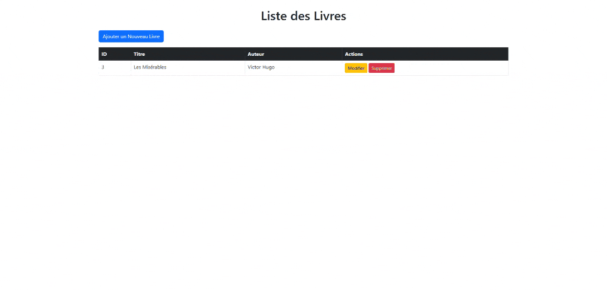

# 📚 Application de Gestion de Livres

Cette application permet de gérer une liste de livres (ajouter, modifier, supprimer et afficher).  
Elle est développée en **Spring Boot** avec **Thymeleaf** pour l'interface utilisateur.

## 🎥 Démonstration  

## 🚀 Technologies utilisées  
- Java 17+  
- Spring Boot  
- Thymeleaf  
- Bootstrap  
- Maven  

